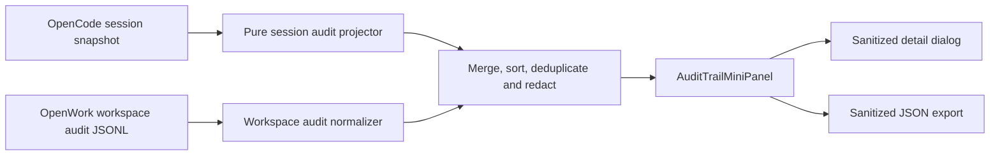

# Kavach Lightweight Audit Trail Roadmap

Status: implementation plan  
Target: single-user Round 1 prototype  
Placement: compact section in the existing left sidebar  
Primary goal: make every agent run understandable without introducing a second agent runtime or a second transcript database

## 1. Executive decision

Kavach should adapt the projection pattern used by DeepSeek Harness, not port its complete event-sourcing subsystem.

DeepSeek Harness builds its Trajectory view from one authoritative, append-only Session event log. Chat, trajectory, replay, export, persistence, usage reporting, and telemetry are projections of that same log. That is a strong long-term architecture, but reproducing its versioned session formats, migration chain, Zstandard framing, write leases, request reconstruction, client definition registry, timeline, and virtualization would be disproportionate for Kavach V1.

OpenWork already receives and persists the information required for a useful trail through OpenCode session snapshots:

- user and assistant messages;
- message creation and completion timestamps;
- provider and model identifiers;
- token usage and cost;
- reasoning and text parts;
- tool names, call identifiers, inputs, outputs, errors, and tool timestamps;
- generated file attachments and artifacts;
- session errors and task status.

OpenWork also has a separate workspace audit log for configuration changes, file uploads, engine reloads, workspace operations, and other server actions. V1 should project session activity from the existing OpenCode snapshot, merge it with the existing workspace audit entries for display, and add no new transcript persistence.

This produces a lightweight **observability trail**. It must not be described as tamper-proof or compliance-grade until the later evidence-log phase is implemented.

## 2. What DeepSeek Harness does

The review used DeepSeek Harness commit `5dda764ed3` and focused on its Session, JSONL persistence, Trajectory, approvals, and export packages.

| Concern | DeepSeek Harness implementation | Lesson for Kavach |
|---|---|---|
| Source of truth | A typed, append-only `SessionEvent` stream with monotonic `seq`, `time`, `type`, and `data` | Derive the UI from authoritative runtime data; do not create UI-only events when the underlying snapshot already contains the fact |
| Run structure | Explicit `turn/start`, `turn/end`, `step/start`, and `step/end` events | Infer turns from OpenCode user/assistant relationships in V1; introduce explicit lifecycle records only if inference proves insufficient |
| Model activity | `assistant/message` retains the final message, timed stream, usage, and interruption state; unsuccessful attempts have a separate event | Show provider/model, duration, usage, status, reasoning summary, and failure without exposing hidden chain-of-thought |
| Tools | `tool/call` and `tool/result` are paired by `callId` | Use OpenCode `callID` as the stable record identity and combine call/result into one sidebar row |
| Approvals | `approval/asked` and `approval/decided` form a durable pair | Record both the request and outcome when Kavach later expands its approval audit coverage |
| Projection | Trajectory is a pure client projection over the shared Session window | Implement a pure Kavach projection module with deterministic unit tests |
| Details | A selected record exposes input, output, timing, usage, images, and attachment summaries | Keep the sidebar row short and move full sanitized detail into a dialog |
| Long histories | Initial tail window, load-older paging, and visible-row virtualization | Defer virtualization; cap V1 to recent records and add paging only after real usage demonstrates the need |
| Persistence | Per-session, versioned JSONL generations; optional checksummed Zstandard frames; append rollback, crash-tail recovery, and a single-writer lease | Do not port this in V1; OpenCode already owns session persistence |
| Export | The live session is flushed, then the session tree and attachments are streamed as a ZIP | Start with a sanitized JSON export of projected records; add an evidence bundle only after complete-history retrieval exists |
| UI safety | Authentication failures are sanitized before entering Trajectory UI state | Redact secrets before storing projected detail or copying/exporting it |

Primary upstream references:

- [Session log architecture](https://github.com/deepseek-ai/deepseek-harness/blob/5dda764ed3/docs/architecture.md#session-log)
- [Session event types](https://github.com/deepseek-ai/deepseek-harness/blob/5dda764ed3/packages/core/session/src/types.ts)
- [Trajectory package](https://github.com/deepseek-ai/deepseek-harness/tree/5dda764ed3/packages/client/ui-trajectory)
- [Trajectory record contract](https://github.com/deepseek-ai/deepseek-harness/blob/5dda764ed3/packages/client/ui-trajectory/src/client/trajectory-record.ts)
- [JSONL persistence](https://github.com/deepseek-ai/deepseek-harness/tree/5dda764ed3/packages/session/session-persistence-jsonl)
- [Session-log export](https://github.com/deepseek-ai/deepseek-harness/tree/5dda764ed3/packages/session-query/session-log-export)
- [Approval event pairing](https://github.com/deepseek-ai/deepseek-harness/blob/5dda764ed3/packages/interaction/user-approval/src/types.ts)

DeepSeek Harness is MIT licensed. If implementation code is copied rather than independently adapted, retain the required copyright and MIT notice.

## 3. Existing Kavach foundations

### Reuse directly

| Existing code | Current capability | V1 use |
|---|---|---|
| `apps/app/src/app/lib/openwork-server.ts` | `OpenworkSessionSnapshot`, `OpenworkAuditEntry`, and `listAudit()` client | Source types and workspace-audit query |
| `apps/app/src/app/lib/opencode-session-native.ts` | Composes session, messages, todos, and status | Existing snapshot acquisition; do not create another fetch path |
| `apps/app/src/react-app/domains/session/sync/session-sync.ts` | Keeps snapshot and transcript query caches current from live events | Makes projected records update during a run |
| `apps/app/src/react-app/domains/session/sync/parse-tool-parts.ts` | Normalizes pending, completed, and failed tools | Reuse its status and safe-output conventions |
| `apps/app/src/components/chat/utils.ts` | Reads message timestamps | Reuse timestamp conventions |
| `apps/app/src/lib/tool-call-duration.ts` | Tracks live client-side tool duration | Use only as a live fallback; prefer durable OpenCode tool timestamps |
| `apps/app/src/app/lib/models-task-analytics.ts` | Already interprets task and tool lifecycle timestamps without sending arguments/results | Reuse its lifecycle rules, not its cloud telemetry transport |
| `apps/server/src/audit.ts` | Appends and reads per-workspace JSONL audit entries | Merge administrative activity into the display |
| `apps/server/src/types.ts` | Defines actor/action/target/summary/timestamp audit fields | Keep this schema unchanged for V1 |
| `apps/app/src/react-app/domains/settings/pages/debug-view.tsx` | Displays recent workspace audit entries | Preserve the debug view; the new sidebar is a user-facing projection |
| `apps/app/src/react-app/domains/session/sidebar/app-sidebar.tsx` | Owns left-sidebar navigation and session rows | Add the compact Audit trail entry and inline section |

### Current limitations

- Workspace audit entries contain administrative actions but not normal model/tool activity.
- The audit endpoint returns only the most recent 200 entries and has no cursor, session filter, or export endpoint.
- `snapshotToUIMessages()` intentionally drops provider/model, usage, cost, and durable tool timing when converting to chat UI messages.
- The main session snapshot currently requests a tail of 140 messages, so a client-only projection is not a complete lifetime export.
- Client-side tool-duration tracking cannot reconstruct duration for restored history.
- Existing JSONL audit entries are append-only by convention but have no hash chain, signature, retention policy, or integrity verifier.
- Absolute file targets may appear in workspace audit entries and must be reduced to workspace-relative paths before user-facing display or export.

## 4. V1 product experience

### Sidebar placement

Add an `Audit trail` row beneath session search and above Dashboard/Automations/Library. Use a shield/check or list-tree icon consistent with the existing Lucide icon set.

The row has:

- a neutral badge with the current task's visible event count;
- an amber dot when an approval is waiting;
- a red dot when the latest task contains a failed tool or session error;
- no badge when no workspace is selected.

Clicking the row toggles an inline `AuditTrailMiniPanel` inside the left sidebar. It does not navigate away from the task and does not introduce a new top-level route.

### Mini-panel contents

The panel should be intentionally small:

- maximum height of approximately 280 px with its own vertical scroll;
- latest 20 records for the selected task;
- one-line rows with icon, label, status, and relative time or duration;
- filters: `Task` and `Workspace` only;
- `Refresh`, `Export`, and `Close` icon actions;
- a short empty state when no task or audit events exist.

Recommended row kinds:

| Kind | Example label | Default visible detail |
|---|---|---|
| User | `Prompt submitted` | Truncated prompt summary |
| Assistant | `GPT-5 completed` | Duration and token count |
| Tool | `Read inspection-report.pdf` | Tool name, status, and duration |
| Artifact | `Created approval-note.docx` | Workspace-relative path |
| Approval | `File write approved` | Decision and time |
| Error | `Spreadsheet tool failed` | Sanitized failure summary |
| Workspace | `Uploaded report.pdf` | Existing server audit summary |

Selecting a row opens a small `Dialog`, not an expanding sidebar tree. The dialog may show sanitized Input, Output, Timing, Model, Usage, Error, and Artifact fields. Raw input/output are collapsed by default.

### Terminology

Use `Audit trail` in the interface because it is understandable to non-technical users. Add a tooltip in V1:

> A local activity record reconstructed from this task and workspace. Integrity verification is not enabled in this version.

Do not label V1 as immutable, tamper-proof, signed, compliance-grade, or legally admissible.

## 5. V1 data flow



Rules:

1. The projection is deterministic: the same snapshot and workspace entries produce the same ordered records.
2. No prompt, tool input, result, or reasoning content is copied into a new database in V1.
3. Live changes arrive through the existing TanStack Query/session-sync path.
4. Workspace audit is fetched only while the panel is open and has a conservative stale time.
5. The panel never blocks chat rendering or task execution.
6. Export contains exactly the redacted projected data currently available and clearly states whether history is partial.

## 6. Proposed client model

Create a discriminated union instead of one bag of optional properties.

```ts
type AuditTrailRecord =
  | AuditUserRecord
  | AuditAssistantRecord
  | AuditToolRecord
  | AuditArtifactRecord
  | AuditApprovalRecord
  | AuditErrorRecord
  | AuditWorkspaceRecord;

type AuditRecordBase = {
  id: string;
  workspaceId: string;
  sessionId: string | null;
  timestamp: number;
  status: "running" | "completed" | "failed" | "waiting" | "cancelled";
  title: string;
  summary: string;
};
```

Additional fields stay kind-specific:

- assistant: provider, model, started/completed time, cost, token usage;
- tool: call ID, tool name, sanitized input/output, start/end time, error;
- artifact: workspace-relative path, file type, source tool call when known;
- approval: request ID, requested action, outcome;
- workspace: actor, action, sanitized target, existing audit ID;
- error: stable code and sanitized message.

Stable IDs should reuse upstream identifiers where possible:

- `message:<messageID>`;
- `tool:<callID>`;
- `workspace:<auditEntry.id>`;
- `artifact:<messageID>:<normalized-path>`.

## 7. Projection rules

### Messages

- A user message becomes one `user` record.
- Consecutive assistant messages linked to the same parent user message form one task turn for summary purposes.
- The last non-summary assistant message provides the displayed provider/model and completion state.
- Use `time.created` and `time.completed` for durable duration.
- Include token usage and cost only when supplied by the provider; show `Not reported` instead of zero when absent.
- Reasoning may be represented as `Reasoning used` plus duration/token totals. Do not expose private chain-of-thought as an audit requirement.

### Tools

- One OpenCode tool part becomes one record keyed by `callID`.
- Prefer `state.time.start` and `state.time.end` for duration.
- Pending/running tools show a running marker without inventing a completed duration.
- Completed and failed states retain sanitized input/output for the detail dialog.
- A tool result that contains an attachment or a safe workspace file path may emit one or more artifact records.

### Workspace audit

- Keep the existing server entry as the authoritative administrative event.
- Convert absolute workspace targets to workspace-relative display paths.
- If an entry cannot be safely relativized, show only a basename or action-specific label.
- Do not attempt to associate a workspace entry with a session unless a durable session ID exists in the source.

### Ordering and deduplication

- Sort by timestamp ascending inside the projection, then render the latest records at the bottom.
- Break timestamp ties by stable source order and ID.
- Do not collapse distinct tool calls merely because their names and arguments match.
- Deduplicate only identical source IDs.

## 8. Redaction and safety policy

Redaction must occur before data enters component state used by search, clipboard, export, or error reporting.

At minimum redact:

- authorization and cookie headers;
- keys named `apiKey`, `token`, `accessToken`, `refreshToken`, `password`, `secret`, or `credential`;
- common bearer-token, OpenAI-key, GitHub-token, AWS-key, and private-key patterns;
- URL query parameters with sensitive names;
- environment-variable values;
- paths outside the authorized workspace;
- provider authentication failure text, following DeepSeek Harness's safe-display approach.

Further rules:

- Cap input/output previews by characters and depth.
- Bound arrays and object keys before rendering.
- Never render arbitrary HTML from tool output.
- Copy and export use the redacted representation, not the raw source object.
- Record that redaction occurred without disclosing the removed value.
- Add a developer-only diagnostic for projection failures; do not put raw failing payloads in telemetry.

## 9. Implementation phases

### Phase 0 — Contracts and pure projection

Goal: prove that useful audit records can be reconstructed without backend changes.

Add:

- `apps/app/src/react-app/domains/audit/audit-trail-types.ts`
- `apps/app/src/react-app/domains/audit/project-session-audit.ts`
- `apps/app/src/react-app/domains/audit/normalize-workspace-audit.ts`
- `apps/app/src/react-app/domains/audit/redact-audit-value.ts`
- focused unit tests under `apps/app/tests/`

Acceptance:

- fixtures cover completed, running, failed, cancelled, and restored-history cases;
- call/result pairing uses `callID`;
- durable timestamps win over live client timers;
- missing usage is not rendered as zero;
- secrets are absent from projected and exported values;
- projection has no filesystem, network, React, or global-store dependency.

### Phase 1 — Lightweight left-sidebar UI

Goal: expose recent activity without replacing the chat.

Add:

- `apps/app/src/react-app/domains/audit/audit-trail-mini-panel.tsx`
- `apps/app/src/react-app/domains/audit/audit-trail-record-dialog.tsx`
- `apps/app/src/react-app/domains/audit/use-audit-trail-controller.ts`

Modify:

- `apps/app/src/react-app/domains/session/sidebar/app-sidebar.tsx`
- `apps/app/src/react-app/domains/session/chat/session-page.tsx`
- `apps/app/src/i18n/locales/en.ts` and every required locale dictionary through the repository's normal i18n workflow

Controller responsibilities:

- read the selected session's existing snapshot query cache;
- subscribe to the current transcript/snapshot updates rather than polling OpenCode again;
- call `listAudit(workspaceId, 50)` only while the panel is open;
- project, merge, redact, sort, and cap rows;
- expose explicit loading, partial-history, error, and refresh states.

Acceptance:

- `Audit trail` appears beneath session search;
- opening it does not change the current route or unmount chat;
- a running tool updates in place and settles without a duplicate row;
- switching sessions immediately changes the task trail;
- workspace activity remains available when no task is selected;
- keyboard and screen-reader operation work at narrow and desktop widths;
- the panel adds no external network request.

### Phase 2 — Sanitized export and evidence links

Goal: make the visible trail demonstrable and portable.

Add:

- deterministic JSON export with `schemaVersion`, scope, generated time, partial-history flag, and redacted records;
- optional CSV summary containing no raw input/output fields;
- artifact rows that open the existing artifact/file preview;
- a visible `External provider` label for OpenAI/ChatGPT-backed runs;
- a `Local` label only when provider configuration proves the request stayed local.

Acceptance:

- export never contains known secret canaries;
- export order is stable for the same source data;
- generated artifacts open through existing safe file-target handling;
- the UI never claims that provider traffic was local without evidence.

### Phase 3 — Complete-history retrieval

Goal: remove the 140-message/200-workspace-entry limits when the product needs a complete task record.

Work:

- add cursor-based OpenCode session-history retrieval or reuse an upstream paging capability if available;
- add `before`, `limit`, `sessionId`, and action filters to the OpenWork audit endpoint;
- stream or page exports instead of buffering unbounded histories;
- load older records explicitly rather than automatically;
- introduce row virtualization only after a measured threshold.

This phase should preserve the V1 record model and UI contract.

### Phase 4 — Tamper-evident evidence log

Goal: support a defensible governance claim for later sovereign deployments.

This is a separate backend feature, not a UI enhancement. Extend the durable schema with:

- monotonic sequence number;
- session/run/turn/call correlation IDs;
- previous-record hash and current-record hash;
- canonical JSON serialization version;
- content hashes for referenced inputs and artifacts;
- provider/model identity;
- approval request and decision pairs;
- explicit redaction metadata;
- integrity verification result;
- retention/export policy version.

Add an integrity verifier that detects deletion, insertion, reordering, or modification. Consider signing periodic checkpoints with a machine-held key after hash chaining works. Keep raw confidential content out of the evidence log when a hash plus controlled source reference is sufficient.

Only after this phase may Kavach describe the feature as tamper-evident. Cryptographic signatures, WORM storage, trusted timestamps, centralized multi-user identity, and SIEM forwarding remain later deployment concerns.

## 10. Test and evaluation plan

### Unit tests

- message-to-record projection;
- tool lifecycle pairing and duration;
- task/session switching;
- stable ordering and deduplication;
- artifact-path normalization;
- recursive redaction and truncation;
- export determinism;
- missing/unknown OpenCode fields fail safely.

### Component tests

- panel open/close and filter selection;
- loading, empty, partial, and error states;
- status badges and accessible labels;
- record dialog defaults raw detail to collapsed;
- long content cannot overflow the sidebar;
- secret canaries never enter rendered text or clipboard/export output.

### Evals

Add focused specs under `evals/specs/` for:

1. A coding task that reads, edits, runs a command, and fails once before succeeding.
2. A scanned-report task that reads an attachment and creates a DOCX artifact.
3. A workspace configuration action alongside a normal agent task.
4. A restored session showing durable timing where available and `Not reported` where it is not.

Evidence should verify the left-sidebar trail, record-detail dialog, live state transition, artifact link, and sanitized export. Run only the relevant eval targets plus changed app tests, following repository guidance.

## 11. V1 definition of done

V1 is complete when:

- the left sidebar contains a lightweight, collapsible Audit trail;
- it shows the latest task and workspace events from existing sources;
- tool calls are paired and update from running to final state;
- provider/model, duration, usage, failure, approval, and artifact information appear when available;
- sensitive values are redacted before display, copy, or export;
- the current chat remains mounted and usable while the panel is open;
- no new database, background daemon, model call, or external service is required;
- unit, component, and focused eval evidence cover the feature;
- the product accurately labels incomplete history and non-tamper-evident data.

## 12. Explicitly deferred from V1

- copying DeepSeek Harness's session persistence implementation;
- complete request reconstruction;
- raw chain-of-thought display;
- interactive timing histogram and zoomable timeline;
- long-history virtualization;
- Zstandard log generations and format migrations;
- cryptographic signing or hash chaining;
- document-level ACLs and multi-user actor identity;
- SIEM, syslog, OpenTelemetry, or remote audit upload;
- cross-device aggregation;
- policy-based retention and legal hold.

These can be introduced without replacing the V1 UI if `AuditTrailRecord` remains the presentation contract and future durable evidence is normalized into that contract.
